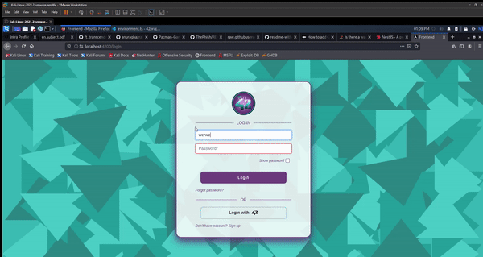

<!-- PROJECT LOGO -->
 

  
 
 <h3 align="center">Transcendence</h3>
  

    Welcome to ft_transcendence!!
  

<!-- TABLE OF CONTENTS -->

  
Table of Contents

    <ol>
      <li>
        <a href="#about-the-project">About The Project</a>
      </li>
      <li>
        <a href="#technologies">Technologies</a>
      </li>
      <li>
        <a href="#installation">Installation</a>
      </li>
      <li><a href="#usage">Usage</a></li>
      <li><a href="#contributing">Contributing</a></li>
      <li><a href="#license">License</a></li>
      <li><a href="#contact">Contact</a></li>
      <li><a href="#acknowledgments">Acknowledgments</a></li>
    </ol>

<!-- ABOUT THE PROJECT -->
## About The Project
Transcendence is a web application where you can play the game pong against other players, climb up the ladder to prove how good you are! 

In the platform you are able to chat with other users, create or join public and private channels, add friends and check their profiles, and of course challenge them into a good old pong game, or even try a different game mode

<!-- TECHNOLOGIES -->
## Technologies
* [nestjs](https://nestjs.com/)
* [Angular](https://angular.io/)
* [Bootstrap](https://getbootstrap.com)

<!-- INSTALLATION -->
## Installation

